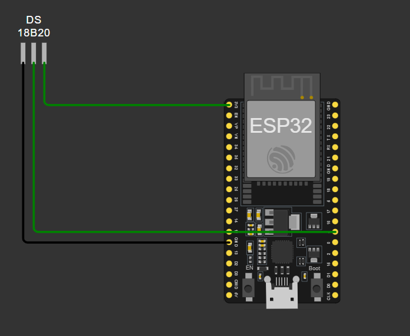

# Serial-Logging
GDSC Serial Logging project

## Circuit Connections

The DS18B20 temperature sensor is interfaced with the ESP32 using the One-Wire communication protocol.

| DS18B20 Pin | ESP32 Connection |
|-------------|------------------|
| GND         | GND              |
| DATA        | GPIO 4           |
| VCC         | 3.3V             |

## Circuit Diagram

## Description

This project implements temperature monitoring using the DHT11 digital temperature sensor with an ESP32 microcontroller.

The DHT11 communicates with the ESP32 via the One-Wire protocol using GPIO 4 as the data line. The sensor operates at 3.3V, and a pull-up resistor is used between the DATA and VCC lines for stable communication.

The ESP32 reads the temperature values from the sensor and transmits the data through serial communication for logging and monitoring purposes.
